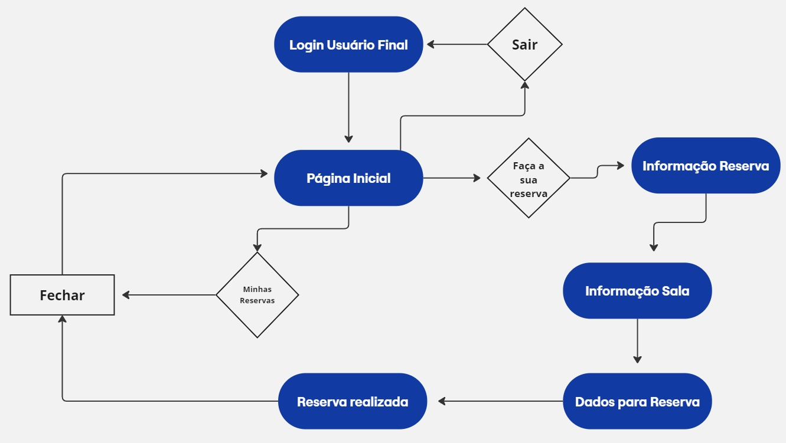
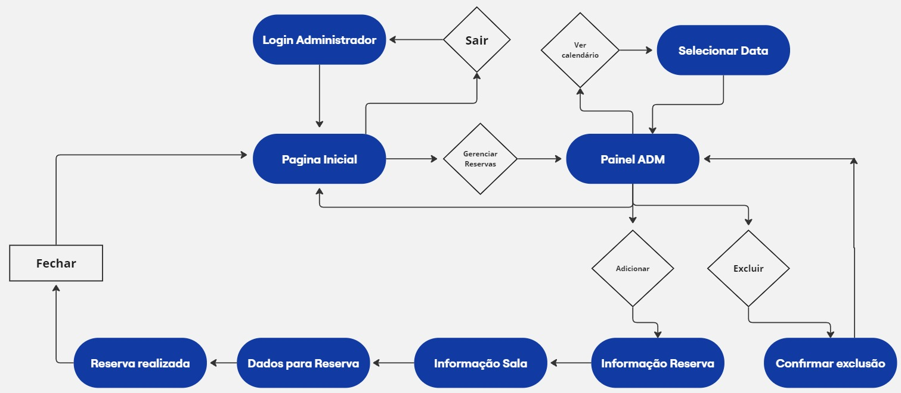

# Projeto de Interface

Pré-requisitos: <a href="2-Especificação do Projeto.md"> Documentação de Especificação</a>

Visão geral da interação do usuário pelas telas do sistema e protótipo interativo das telas com as funcionalidades que fazem parte do sistema (wireframes).

 Apresente as principais interfaces da plataforma. Discuta como ela foi elaborada de forma a atender os requisitos funcionais, não funcionais e histórias de usuário abordados nas <a href="2-Especificação do Projeto.md"> Documentação de Especificação</a>.

## Diagrama de Fluxo

O fluxo do usuário terá início na tela de login, onde após a devida autenticação (com e-mail e senha), o mesmo poderá acessar a home page de acordo com o seu perfil, seja ele de usuário final ou administrador. A página inicial para ambos os perfis permite a visualização das opções/funcionalidades disponíveis para cada um.

Segue abaixo uma visualização do User Flow baseada no relacionamento da página inicial e das telas referentes à cada funcionalidade:

### Diagrama de Fluxo Usuário Final

### Diagrama de Fluxo Administrador

## Wireframes

Abaixo, segue os Wireframes do app SHARED SPACES: 

### Tela de Login Usuário

A página inicial é o ponto de partida para explorar o que oferecemos. Nela você tem a opção de cadastrar no aplicativo, fornecendo dados básicos, como nome, telefone e E-mail ou fazer o Login, caso já tenha conta:

### Página Inicial Usuário

Permite que o usuário consiga fazer uma reserva, acompanhar sua reservas ou sair do aplicativo:

### Informação da Reserva

Permite que o usuário realize a reserva, informando dados como data, quantidade de pessoas, horário da entrada e horário da saída:

### Informação da Sala

Mostra as informações preenchidas da reserva e dá a opção de escolher o tipo da sala que desejar:

### Reserva realizada

Traz as informações da reserva que foi realizada:

### Tela de Login ADM

Página de login para ADM:

### Página inicial ADM

Permite olhar às reservas feitas, realizar novas ou sair do aplicativo:

### Painel ADM

Painel com as reservas e opção de alterar através do calendário ou excluir a reserva realizada:

### Excluir reserva

Permite excluir a reserva realizada:

### Calendário

Permite visualizar às datas através do calendário, para alterar a reserva:

