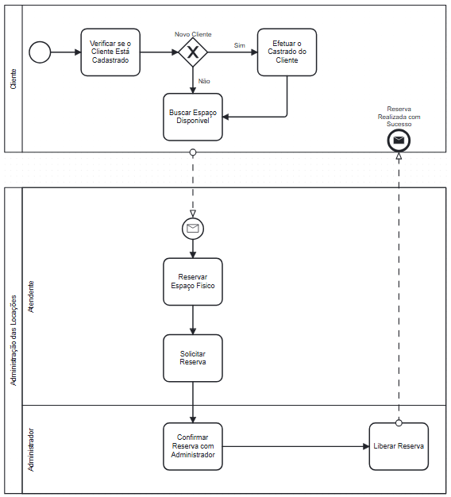
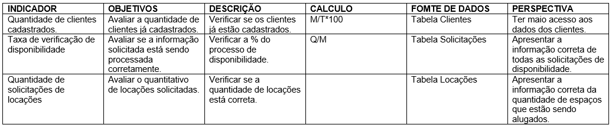
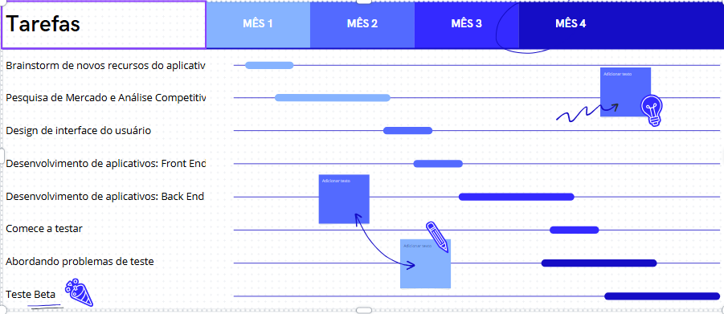
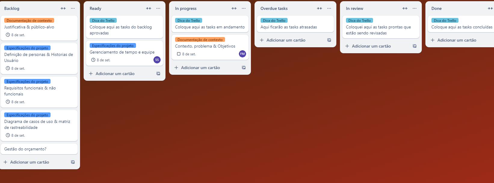

# Especificações do Projeto

<table>
    <tbody>
        <tr align=center>
            <th colspan="2">Perfil 1: Administrador dos Espaços / Dono das Salas</th>
        </tr>
        <tr>
            <td width="150px"><b>Descrição</b></td>
            <td width="600px">Responsável pela gestão dos espaços de coworking e salas de reunião. Este perfil pode pertencer ao proprietário dos espaços ou a um gestor designado para administrar o uso, manutenção e a rentabilidade das salas. O administrador tem a responsabilidade de gerenciar a disponibilidade das salas, processar reservas, lidar com pagamentos e manter a qualidade do ambiente para os usuários.</td>
        </tr>
        <tr>
            <td><b>Necessidades</b></td>
            <td>
                <ol>
                    <li>Autenticar no sistema.</li>
                    <li>Gerenciar a disponibilidade das salas (reservas, horários, manutenção).</li>
                    <li>Informar pagamento da sala no sistema.</li>
                    <li>Gerenciar o pagamento no sistema.</li>
                </ol> 
            </td>
        </tr>
    </tbody>
</table>

<table>
    <tbody>
        <tr align=center>
            <th colspan="2">Perfil 2: Usuário Final</th>
        </tr>
        <tr>
            <td width="150px"><b>Descrição</b></td>
            <td width="600px">Profissionais, empresas ou freelancers que necessitam alugar salas de coworking ou reuniões por períodos específicos. Este perfil representa o cliente que busca um espaço para trabalhar ou realizar reuniões, com a expectativa de facilidade na reserva, conforto e qualidade do ambiente.</td>
        </tr>
        <tr>
            <td><b>Necessidades</b></td>
            <td>
                <ol>
                    <li>Visualizar a disponibilidade das salas e escolher a mais adequada. </li>
                    <li>Reservar salas para períodos específicos.</li>
                    <li>Receber confirmações de reservas (número de Protocolo).</li>
                    <li>Visualizar e gerenciar suas reservas (visualização ou cancelamentos).</li>
                </ol> 
            </td>
        </tr>
    </tbody>
</table>

## Personas

As personas levantadas durante o processo de entendimento do problema são apresentadas nas tabelas que se seguem:

<table>
    <thead>
        <tr>
            <th>Persona</th>        
            <th>1</th>              
        </tr>
    </thead>
    <tbody>
     <tr>
            <td>João</td>
            <td></td>
        </tr>
     <tr>
            <td>Idade: 35 anos</td>
            <td>Ocupação: Gerente de Projetos em uma empresa de tecnologião</td>
        </tr>
        <tr>
            <td>Objetivos: João precisa frequentemente reservar salas para reuniões de equipe, apresentações para clientes e sessões de planejamento de projetos. Ele valoriza a facilidade e rapidez na reserva e precisa de ferramentas para agendar reuniões recorrentes.</td>
            <td>Frustrações: Encontrar salas disponíveis em horários de pico e a dificuldade de visualizar ou cancelar a reserva.</td>
        </tr>
        <tr>
            <td>Tecnologia: Usuário avançado de ferramentas de produtividade, usa principalmente o computador para gerenciar seu trabalho.</td>
            <td>Necessidades: Notificações de alterações nas reservas, integração com calendário, e opção de reserva antecipada.</td> 
        </tr>
    </tbody>
</table>

<table>
    <thead>
        <tr>
            <th>Persona</th>        
            <th>2</th>              
        </tr>
    </thead>
    <tbody>
     <tr>
            <td>Mariana</td>
            <td></td>
        </tr>
     <tr>
            <td>Idade: 22 anos</td>
            <td>Ocupação: Estudante de engenharia</td>
        </tr>
        <tr>
            <td>Objetivos: Mariana precisa reservar salas de estudo para trabalhos em grupo, sessões de revisão antes de provas, e apresentações de projetos. Ela valoriza a disponibilidade de salas silenciosas e bem equipadas.</td>
            <td>Frustrações: Dificuldade em encontrar salas disponíveis durante a época de provas e em locais próximos ao campus.</td>
        </tr>
        <tr>
            <td>Tecnologia: Usuária de smartphone, utiliza o sistema principalmente por aplicativos móveis.</td>
            <td>Necessidades: Interface intuitiva, fácil navegação e disponibilidade em tempo real.</td>
        </tr>
    </tbody>
</table>

<table>
    <thead>
        <tr>
            <th>Persona</th>        
            <th>3</th>              
        </tr>
    </thead>
    <tbody>
     <tr>
            <td>Ana</td>
            <td></td>
        </tr>
     <tr>
            <td>Idade: 42 anos</td>
            <td>Ocupação: Secretária Executiva em uma empresa de consultoria</td>
        </tr>
        <tr>
            <td>Objetivos: Ana é responsável por agendar reuniões para os executivos da empresa, coordenar videoconferências, e garantir que as salas estejam preparadas para eventos. Ela precisa de um sistema confiável que permita gerenciar a reserva sem precisar realizar contato telefônico.</td>
            <td>Frustrações: Inconsistências na disponibilidade das salas.</td>
        </tr>
        <tr>
            <td>Tecnologia: Usuária de desktop, usa o sistema principalmente em um computador no escritório.</td>
            <td>Necessidades: Acesso rápido a reserva, opção de gerenciamento de reserva.</td>
        </tr>
    </tbody>
</table>

<table>
    <thead>
        <tr>
            <th>Persona</th>        
            <th>4</th>              
        </tr>
    </thead>
    <tbody>
     <tr>
            <td>Lucas</td>
            <td></td>
        </tr>
     <tr>
            <td>Idade: 45 anos</td>
            <td>Ocupação: Pesquisador em uma universidade</td>
        </tr>
        <tr>
            <td>Objetivos: Lucas precisa de salas para conduzir seminários, grupos de discussão e reuniões com colaboradores de pesquisa. Ele valoriza a privacidade e a disponibilidade de recursos para apresentações acadêmicas.</td>
            <td>Frustrações: Concorrência pelas salas de seminários e dificuldade em agendar salas para períodos prolongados.</td>
        </tr>
        <tr>
            <td>Tecnologia: Usuário de laptop e tablet, prefere usar o sistema em dispositivos que possa levar para suas reuniões.</td>
            <td>Necessidades: Reserva de longos período.</td>
        </tr>
    </tbody>
</table>

## Histórias de Usuários

Com base na análise das personas forma identificadas as seguintes histórias de usuários:

|EU COMO... `PERSONA`| QUERO/PRECISO ... `FUNCIONALIDADE` |PARA ... `MOTIVO/VALOR`                 |
|--------------------|------------------------------------|----------------------------------------|
|João       | Como gerente de projetos, preciso reservar salas de reunião de forma rápida e eficiente.                 | Garantir que sua equipe tenha um espaço adequado para reuniões de planejamento e apresentações para clientes. |
|Mariana       | Precisa reservar salas de estudo silenciosas e bem equipadas.                 | Para trabalhos em grupo e sessões de revisão antes das provas. |
|Ana       | Precisa agendar reuniões para os executivos da empresa e coordenar videoconferências.                  | Garantir que as salas estejam preparadas para eventos. Ela quer um sistema confiável que permita gerenciar as reservas |
|Lucas       | Precisa reservar salas para seminários, grupos de discussão e reuniões com colaboradores de pesquisa.                  | Ele valoriza a privacidade e a disponibilidade de recursos para apresentações acadêmicas e deseja reservar salas por longos períodos. |

## Modelagem do Processo de Negócio 

### Análise da Situação Atual

Todo o processo de locação realizado manualmente, causando lentindão e confusão na locação dos espaços.

### Descrição Geral da Proposta

Projeto criado para a agilidade e facilidade, na locação e demosntração de espaços disponiveis, para locação.

### Processo  – SISTEMA PARA LOCAÇÃO COOWORKING

## Indicadores de Desempenho

## Requisitos

As tabelas que se seguem apresentam os requisitos funcionais e não funcionais que detalham o escopo do projeto.

### Requisitos Funcionais

<table>
    <thead>
        <tr>
            <th>ID</th>        
            <th>Descrição</th>        
            <th>Prioridade</th>        
        </tr>
    </thead>
    <tbody>
        <tr>
            <td>RF- 01</td>
            <td>Desenvolver tela de autenticação do usuário administrador.</td>
            <td>Alta</td>
        </tr>
        <tr>
            <td>RF- 02</td>
            <td>Desenvolver tela de gerenciamento de Salas, permitindo cadastro, edição, visualização e exclusão de informações.</td>
            <td>Alta</td>
        </tr>
        <tr>
            <td>RF- 03</td>
            <td>Desenvolver tela para visualização da disponibilidade das salas em tempo real pelo usuário.</td>
            <td>Alta</td>
        </tr>
        <tr>
            <td>RF- 04</td>
            <td>Desenvolver tela para realização de reservas de salas para períodos específicos, com confirmação imediata.</td>
            <td>Alta</td>
        </tr>
        <tr>
            <td>RF- 05</td>
            <td>Desenvolver tela para cadastro de cartão de crédito para pagamento.</td>
            <td>Alta</td>
        </tr>
        <tr>
            <td>RF- 06</td>
            <td>Desenvolver tela de Usuários, permitindo cadastro, edição, visualização e exclusão de perfis.</td>
            <td>Média</td>
        </tr>
        <tr>
            <td>RF- 07</td>
            <td>Desenvolver tela para que administradores possam cancelar reservas.</td>
            <td>Média</td>
        </tr>
        <tr>
            <td>RF- 08</td>
            <td>Desenvolver tela onde o cliente consegue reservar uma sala, acompanhar e/ou cancelar sua reserva.</td>
            <td>Alta</td>
        </tr>
    </tbody>
</table>

### Requisitos não Funcionais

<table>
    <thead>
        <tr>
            <th>ID</th>        
            <th>Descrição</th>        
            <th>Prioridade</th>        
        </tr>
    </thead>
    <tbody>
        <tr>
            <td>RNF-01</td>
            <td>Desenvolver mecanismos para garantir a segurança dos dados dos usuários.</td>
            <td>Alta</td>
        </tr>
        <tr>
            <td>RNF-02</td>
            <td>Desenvolver interface do usuário intuitiva e de fácil utilização.</td>
            <td>Média</td>
        </tr>
        <tr>
            <td>RNF-03</td>
            <td>Desenvolver sistema compatível com diferentes dispositivos e navegadores web.</td>
            <td>Média</td>
        </tr>
        <tr>
            <td>RNF-04</td>
            <td>Desenvolver código bem estruturado e documentado para fácil manutenção.</td>
            <td>Média</td>
        </tr>
         <tr>
            <td>RNF-05</td>
            <td>O sistema deve ser responsivo, funcionando em dispositivos móveis e desktops.O sistema deve ser responsivo, funcionando em dispositivos móveis e desktops.</td>
            <td>Alta</td>
        </tr>
         <tr>
            <td>RNF-06</td>
            <td>O sistema deve garantir a segurança dos dados do usuário, criptografando senhas e dados sensíveis.</td>
            <td>Alta</td>
        </tr>
       <td>RNF-07</td>
            <td>O sistema deve suportar até 1.000 usuários simultâneos sem degradação de performance.</td>
            <td>Média</td>
        </tr>
     <td>RNF-08</td>
            <td>O sistema deve ser escalável para suportar crescimento do número de usuários e de dados. </td>
            <td>Alta</td>
        </tr>
     <td>RNF-09</td>
            <td>O sistema deve ter alta disponibilidade, com no mínimo 99% de uptime.</td>
            <td>Alta</td>
        </tr>
    </tbody>
</table>

**Prioridade: Alta / Média / Baixa. 

## Restrições

O projeto está restrito pelos itens apresentados na tabela a seguir.

<table>
    <thead>
        <tr>
            <th>ID</th>        
            <th>Descrição</th>              
        </tr>
    </thead>
    <tbody>
        <tr>
            <td>RE-01</td>
            <td>A aplicação deve ser entregue de forma plenamente funcional até o final do semestre.</td>
        </tr>
        <tr>
            <td>RE-02</td>
            <td>Cada integrante da equipe ficará responsável pelo desenvolvimento completo (Back-End e Front-End) das funcionalidades pelas quais ficou responsável.</td>
        </tr>
    </tbody>
</table>

<h2>Diagrama de Casos de Uso</h2>

# Gerenciamento de Projeto

## Gerenciamento de Tempo

Ter uma visão detalhada do cronograma de um projeto é essencial para garantir que todas as etapas sejam cumpridas dentro do prazo. Dividir o trabalho em fases e etapas, com datas claras de início e término, ajuda a manter o foco e a organização. Cada etapa tem sua importância e precisa ser tratada com atenção para evitar atrasos que possam afetar o andamento geral do projeto.

Com um planejamento bem estruturado, todos os envolvidos podem acompanhar o progresso e ajustar o ritmo conforme necessário. Isso torna o processo mais fluido e aumenta as chances de sucesso na entrega final, garantindo que cada parte do projeto esteja alinhada com o objetivo maior.

## Gerenciamento de Equipe

Manter um projeto organizado é crucial para que tudo saia conforme o planejado. Ao dividir as tarefas em categorias como "Backlog", "Ready", "In Progress", e "Done", é possível ter uma visão clara do que precisa ser feito e o que já foi concluído. Esse tipo de organização facilita o controle do tempo, ajuda a priorizar as atividades mais importantes e evita atrasos.

Além disso, com todas as etapas visíveis, a equipe consegue acompanhar o andamento das tarefas e colaborar de forma mais eficiente. Se algo sair do planejado, é mais fácil ajustar as ações e garantir que o projeto siga em frente sem grandes problemas.

## Gestão de Orçamento

O processo de determinar o orçamento do projeto é uma tarefa que depende, além dos produtos (saídas) dos processos anteriores do gerenciamento de custos, também de produtos oferecidos por outros processos de gerenciamento, como o escopo e o tempo.

